# FASE 0 — Inventario Completo: Lineage de Milestones ACHIEVED vs PAID

**Fecha:** 2025-01-XX  
**Proyecto:** Resolver inconsistencia "M5 pagado sin M1 pagado"  
**Estado:** ✅ COMPLETADO

---

## 1. Objetos Relacionados (Inventario Completo)

### 1.1 Fuentes RAW (Tablas Base)

| Objeto | Schema | Tipo | Propósito | Columnas Clave |
|--------|--------|------|-----------|----------------|
| `public.module_ct_cabinet_payments` | `public` | TABLE | Pagos reconocidos por Yango (PAID) | `trip_1`, `trip_5`, `trip_25`, `driver_id`, `person_key`, `created_at` |
| `public.summary_daily` | `public` | TABLE | Viajes reales completados (fuente de ACHIEVED) | `driver_id`, `date_file`, `count_orders_completed` |
| `public.module_ct_cabinet_leads` | `public` | TABLE | Leads de registro en Yango | `external_id`, `park_phone`, `lead_created_at`, `active_1`, `active_5`, `active_25` |
| `public.drivers` | `public` | TABLE | Catálogo de conductores | `driver_id`, `full_name`, `phone`, `license_number` |

**Ruta de migración:** `backend/alembic/versions/012_add_identity_to_cabinet_payments.py`  
**Nota:** `module_ct_cabinet_payments` tiene columnas `driver_id` y `person_key` agregadas en migración 012.

---

### 1.2 Vistas Observacionales (ACHIEVED - Operativo)

| Objeto | Schema | Tipo | Propósito | Fuente |
|--------|--------|------|-----------|--------|
| `observational.v_conversion_metrics` | `observational` | VIEW | Métricas de conversión por lead | `public.module_ct_cabinet_leads` + `public.drivers` |
| `ops.v_payment_calculation` | `ops` | VIEW | Vista canónica C2: calcula milestones ACHIEVED | `observational.v_conversion_metrics` + `public.summary_daily` + `ops.partner_payment_rules` |

**Archivo:** `backend/sql/ops/v_payment_calculation.sql`  
**Grano:** `(person_key, origin_tag, rule_id)` - múltiples filas por persona cuando cumple múltiples reglas  
**Campos clave:**
- `milestone_achieved` (boolean) - Si se alcanzó el milestone dentro de la ventana
- `milestone_trips` (integer) - Valor del milestone (1, 5, 25)
- `achieved_date` (date) - Fecha en que se alcanza el milestone
- `achieved_trips_in_window` (integer) - Viajes acumulados en achieved_date
- `is_payable` (boolean) - Si el pago es elegible
- `payable_date` (date) - Fecha calculada para realizar el pago

---

### 1.3 Vistas de Claims (ACHIEVED + PAID)

| Objeto | Schema | Tipo | Propósito | Fuente |
|--------|--------|------|-----------|--------|
| `ops.v_claims_payment_status_cabinet` | `ops` | VIEW | Claims con estado de pago (mezcla ACHIEVED + PAID) | `ops.v_payment_calculation` (ACHIEVED) + `ops.v_yango_payments_ledger_latest_enriched` (PAID) |

**Archivo:** `backend/sql/ops/v_claims_payment_status_cabinet.sql`  
**Grano:** `(driver_id, milestone_value)` - 1 fila por claim (deduplicación con DISTINCT ON)  
**Campos clave:**
- `milestone_value` (integer) - Valor del milestone (1, 5, 25)
- `paid_flag` (boolean) - Si existe pago asociado
- `paid_date` (date) - Fecha de pago si existe
- `payment_status` (text) - 'paid' o 'not_paid'
- `reason_code` (text) - Diagnóstico detallado de no pago

**Filtros aplicados:**
- `WHERE origin_tag = 'cabinet' AND milestone_value IN (1, 5, 25) AND milestone_achieved = true`

---

### 1.4 Vistas de Cobranza

| Objeto | Schema | Tipo | Propósito | Fuente |
|--------|--------|------|-----------|--------|
| `ops.v_yango_cabinet_claims_for_collection` | `ops` | VIEW | Vista final para export a Yango (cobrable) | `ops.v_claims_payment_status_cabinet` |

**Archivo:** `backend/sql/ops/v_yango_cabinet_claims_for_collection.sql`  
**Grano:** `(driver_id, milestone_value)` - 1 fila por claim  
**Campo canónico:** `yango_payment_status` (text) - 'PAID', 'PAID_MISAPPLIED', 'UNPAID'

**Materializada:**
- `ops.mv_yango_cabinet_claims_for_collection` (MATERIALIZED VIEW)
- **Archivo:** `backend/sql/ops/create_mv_yango_cabinet_claims_for_collection.sql`

---

### 1.5 Vistas de Export/UI

| Objeto | Schema | Tipo | Propósito | Fuente |
|--------|--------|------|-----------|--------|
| `ops.v_partner_payments_report` | `ops` | VIEW | Reporte detallado de pagos partners | `ops.v_payment_calculation` |
| `ops.v_partner_payments_report_ui` | `ops` | VIEW | Versión UI-friendly del reporte | `ops.v_partner_payments_report` |
| `ops.v_yango_receivable_payable_detail` | `ops` | VIEW | Vista de export (filtra is_payable=true) | `ops.v_partner_payments_report_ui` |
| `ops.mv_yango_receivable_payable_detail` | `ops` | MATERIALIZED VIEW | Materializada de la anterior | `ops.v_yango_receivable_payable_detail` |

**Archivos:**
- `backend/sql/ops/v_payments_reports_ui.sql` (contiene `v_partner_payments_report_ui`)
- `backend/sql/ops/_analysis_v_receivable_payable_detail_def.sql` (definición de `v_yango_receivable_payable_detail`)

**Filtros críticos:**
- `ops.v_yango_receivable_payable_detail`: `WHERE is_payable = true AND amount > 0` ⚠️ **Este filtro puede ocultar M1**

**Campos clave:**
- `milestone_achieved` (boolean) - Si se alcanzó el milestone
- `is_payable` (boolean) - Si el pago es elegible
- `payable_date` (date) - Fecha calculada para realizar el pago
- `achieved_date` (date) - Fecha en que se alcanza el milestone

---

### 1.6 Vistas de Ledger (PAID)

| Objeto | Schema | Tipo | Propósito | Fuente |
|--------|--------|------|-----------|--------|
| `ops.v_yango_payments_ledger_latest_enriched` | `ops` | VIEW | Ledger de pagos enriquecido con identidad | `public.module_ct_cabinet_payments` + matching de identidad |

**Campos clave:**
- `is_paid` (boolean) - Si el pago está marcado como pagado
- `milestone_value` (integer) - Valor del milestone (1, 5, 25)
- `driver_id_final` (text) - Driver ID después de matching
- `person_key_final` (uuid) - Person key después de matching
- `pay_date` (date) - Fecha del pago

---

### 1.7 Vistas de Presentación (UI Final)

| Objeto | Schema | Tipo | Propósito | Fuente |
|--------|--------|------|-----------|--------|
| `ops.v_payments_driver_matrix_cabinet` | `ops` | VIEW | Vista de presentación (1 fila por driver) | `ops.v_claims_payment_status_cabinet` + `ops.v_yango_cabinet_claims_for_collection` + `ops.v_yango_payments_claims_cabinet_14d` |

**Archivo:** `backend/sql/ops/v_payments_driver_matrix_cabinet.sql`  
**Grano:** `(driver_id)` - 1 fila por driver (agregación por GROUP BY)  
**Campos clave (confusos):**
- `m1_achieved_flag`, `m5_achieved_flag`, `m25_achieved_flag` - ⚠️ **Nombre dice "achieved" pero viene de claims que mezcla ACHIEVED + PAID**
- `m1_yango_payment_status`, `m5_yango_payment_status`, `m25_yango_payment_status` - Estado de pago Yango
- `m5_without_m1_flag`, `m25_without_m5_flag` - Flags de inconsistencia

**Vista de verificación:** `backend/sql/ops/v_payments_driver_matrix_cabinet_verification.sql`

---

### 1.8 Vistas Auxiliares

| Objeto | Schema | Tipo | Propósito |
|--------|--------|------|-----------|
| `ops.v_yango_payments_claims_cabinet_14d` | `ops` | VIEW | Claims con window_status (active/expired) |
| `ops.v_payment_calculation` | `ops` | VIEW | Cálculo de elegibilidad (ya listada arriba) |
| `ops.v_driver_name_index` | `ops` | VIEW | Índice de nombres de conductores |

---

## 2. Data Lineage Map

### 2.1 Diagrama de Flujo Completo

```mermaid
graph TB
    subgraph FuentesRAW["FUENTES RAW"]
        SD[public.summary_daily<br/>Viajes reales]
        MCL[public.module_ct_cabinet_leads<br/>Leads de registro]
        MCP[public.module_ct_cabinet_payments<br/>Pagos reconocidos PAID]
        DRV[public.drivers<br/>Catálogo conductores]
    end

    subgraph VistasCanonicas["VISTAS CANÓNICAS (ACHIEVED)"]
        VCM[observational.v_conversion_metrics<br/>Métricas de conversión]
        VPC[ops.v_payment_calculation<br/>Vista canónica C2<br/>milestone_achieved, achieved_date]
    end

    subgraph VistasClaims["VISTAS DE CLAIMS (ACHIEVED + PAID)"]
        VCPS[ops.v_claims_payment_status_cabinet<br/>Claims con estado de pago<br/>Grano: driver_id + milestone_value]
    end

    subgraph VistasCobranza["VISTAS DE COBRANZA"]
        VYCC[ops.v_yango_cabinet_claims_for_collection<br/>Vista final export Yango<br/>yango_payment_status]
        MVYCC[ops.mv_yango_cabinet_claims_for_collection<br/>MATERIALIZED VIEW]
    end

    subgraph VistasExport["VISTAS DE EXPORT/UI"]
        VPPR[ops.v_partner_payments_report<br/>Reporte detallado]
        VPPRU[ops.v_partner_payments_report_ui<br/>Versión UI-friendly]
        VYRPD[ops.v_yango_receivable_payable_detail<br/>WHERE is_payable=true ⚠️ FILTRO]
        MVYRPD[ops.mv_yango_receivable_payable_detail<br/>MATERIALIZED VIEW]
    end

    subgraph VistasLedger["VISTAS DE LEDGER (PAID)"]
        VYPLE[ops.v_yango_payments_ledger_latest_enriched<br/>Ledger enriquecido<br/>is_paid, driver_id_final]
    end

    subgraph VistaFinal["VISTA FINAL (PRESENTACIÓN)"]
        VPDMC[ops.v_payments_driver_matrix_cabinet<br/>1 fila por driver<br/>m1_achieved_flag ⚠️ CONFUSO]
    end

    %% Flujo ACHIEVED
    SD --> VCM
    MCL --> VCM
    DRV --> VCM
    VCM --> VPC
    SD --> VPC
    VPC --> VCPS

    %% Flujo PAID
    MCP --> VYPLE
    VYPLE --> VCPS

    %% Flujo Claims
    VCPS --> VYCC
    VYCC --> MVYCC

    %% Flujo Export
    VPC --> VPPR
    VPPR --> VPPRU
    VPPRU --> VYRPD
    VYRPD --> MVYRPD

    %% Flujo Presentación
    VCPS --> VPDMC
    VYCC --> VPDMC

    style MCP fill:#ffcccc
    style VPC fill:#ccffcc
    style VCPS fill:#ffffcc
    style VYRPD fill:#ffcccc
    style VPDMC fill:#ffcccc
```



### 2.2 Leyenda

- 🟢 **Verde:** Vistas de ACHIEVED (operativo - viajes logrados)
- 🔴 **Rojo:** Vistas de PAID (pagos reconocidos) o vistas que mezclan conceptos
- 🟡 **Amarillo:** Vistas que mezclan ACHIEVED + PAID

---

## 3. Claves de Join

### 3.1 Identificadores Principales

| Clave | Tipo | Uso | Disponibilidad |
|-------|------|-----|----------------|
| `driver_id` | `text` | ID del conductor | Disponible en todas las capas |
| `person_key` | `uuid` | Identidad canónica | Disponible en capas canónicas y claims |
| `milestone_value` | `integer` | Valor del milestone (1, 5, 25) | Disponible en todas las capas |
| `lead_date` | `date` | Fecha del lead | Disponible en capas canónicas y claims |

### 3.2 Joins Principales

**En `ops.v_claims_payment_status_cabinet`:**
- `driver_id` + `milestone_value` → `ops.v_payment_calculation` (ACHIEVED)
- `driver_id` + `milestone_value` → `ops.v_yango_payments_ledger_latest_enriched` (PAID)

**En `ops.v_payments_driver_matrix_cabinet`:**
- `driver_id` → `ops.v_claims_payment_status_cabinet` (LEFT JOIN por milestone_value)
- `driver_id` → `ops.v_yango_cabinet_claims_for_collection` (LEFT JOIN por milestone_value)
- `driver_id` → `public.drivers` (para `driver_name`)

---

## 4. Grain Esperado por Capa

| Capa | Grano | Cardinalidad | Notas |
|------|-------|--------------|-------|
| `public.module_ct_cabinet_payments` | `(payment_key, milestone_value)` | Múltiples filas por driver | Un pago puede tener múltiples milestones |
| `ops.v_payment_calculation` | `(person_key, origin_tag, rule_id)` | Múltiples filas por persona | Una persona puede cumplir múltiples reglas |
| `ops.v_claims_payment_status_cabinet` | `(driver_id, milestone_value)` | 1 fila por claim | Deduplicación con DISTINCT ON |
| `ops.v_yango_cabinet_claims_for_collection` | `(driver_id, milestone_value)` | 1 fila por claim | Mismo grano que claims |
| `ops.v_yango_receivable_payable_detail` | `(person_key, milestone_value, payable_date)` | Múltiples filas por persona | Filtro: `is_payable = true` |
| `ops.v_payments_driver_matrix_cabinet` | `(driver_id)` | 1 fila por driver | Agregación por GROUP BY |

---

## 5. Filtros Críticos Identificados

### 5.1 Filtros que Pueden Ocultar M1

**⚠️ CRÍTICO: `ops.v_yango_receivable_payable_detail`**
```sql
WHERE is_payable = true AND amount > 0
```
- **Efecto:** Si M1 no es `is_payable = true`, desaparece de esta vista
- **Impacto:** M1 puede existir en `v_payment_calculation` pero no aparecer en `v_yango_receivable_payable_detail`

**En `ops.v_claims_payment_status_cabinet`:**
```sql
WHERE origin_tag = 'cabinet' 
  AND milestone_value IN (1, 5, 25) 
  AND milestone_achieved = true
```
- **Efecto:** Solo muestra milestones ACHIEVED
- **Impacto:** Si M1 no se alcanzó, no aparece en claims

---

## 6. Mapeo Driver Name → Driver ID / Person Key

### 6.1 Fuentes de Mapeo

| Fuente | Campo Driver Name | Campo Driver ID | Campo Person Key |
|--------|------------------|-----------------|------------------|
| `public.drivers` | `full_name` | `driver_id` | ❌ No disponible |
| `ops.v_driver_name_index` | `driver_name` | `driver_id` | ❌ No disponible |
| `ops.v_claims_payment_status_cabinet` | ❌ No disponible | `driver_id` | `person_key` |
| `ops.v_yango_cabinet_claims_for_collection` | `driver_name` (desde `public.drivers`) | `driver_id` | `person_key` |

**Join típico:**
```sql
LEFT JOIN public.drivers d ON d.driver_id = c.driver_id
```

---

## 7. Conceptos Clave: ACHIEVED vs PAID

### 7.1 ACHIEVED (Milestones Operativos)

**Definición:** El driver logró X viajes en la ventana especificada según reglas de negocio.

**Fuente canónica:** `ops.v_payment_calculation`
- Campo: `milestone_achieved` (boolean)
- Campo: `achieved_date` (date)
- Campo: `achieved_trips_in_window` (integer)

**Cálculo:** Basado en `public.summary_daily.count_orders_completed` acumulado desde `lead_date` dentro de `window_days`.

### 7.2 PAID (Milestones Pagados por Yango)

**Definición:** Yango reconoció/pagó el milestone M1/M5/M25.

**Fuente canónica:** `public.module_ct_cabinet_payments`
- Campos: `trip_1`, `trip_5`, `trip_25` (boolean)

**Nota importante:** Por negocio puede existir `paid_m5 = true` con `paid_m1 = false` (Yango paga M5 y no paga M1, y luego puede enmendar).

---

## 8. Problema Identificado: Confusión de Naming

### 8.1 Campo Confuso

**`ops.v_payments_driver_matrix_cabinet.m1_achieved_flag`**

- **Nombre sugiere:** "M1 fue alcanzado (ACHIEVED)"
- **Realidad:** Viene de `ops.v_claims_payment_status_cabinet` que mezcla ACHIEVED + PAID
- **Fuente real:** `ops.v_claims_payment_status_cabinet` que usa `ops.v_payment_calculation` (ACHIEVED) pero también verifica PAID

**Conclusión:** El nombre es ambiguo. Debería ser más claro o separarse en:
- `m1_achieved_flag` (desde `v_payment_calculation`)
- `m1_paid_flag` (desde `yango_payment_status`)

---

## 9. Archivos de Referencia

### 9.1 SQL Files

- `backend/sql/ops/v_payment_calculation.sql` - Vista canónica C2
- `backend/sql/ops/v_claims_payment_status_cabinet.sql` - Claims con estado de pago
- `backend/sql/ops/v_yango_cabinet_claims_for_collection.sql` - Vista final cobranza
- `backend/sql/ops/v_payments_driver_matrix_cabinet.sql` - Vista presentación
- `backend/sql/ops/v_payments_reports_ui.sql` - Vistas UI-friendly
- `backend/sql/ops/_analysis_v_receivable_payable_detail_def.sql` - Definición receivable_payable_detail

### 9.2 Backend Files

- `backend/app/api/v1/yango_payments.py` - Endpoints de pagos Yango
- `backend/app/api/v1/ops_payments.py` - Endpoints de operaciones (si existe)

### 9.3 Frontend Files

- `frontend/app/pagos/driver-matrix/page.tsx` - UI de driver matrix (si existe)

---

## 10. Próximos Pasos (FASE 1)

1. Identificar todos los lugares donde se usa `m1_achieved_flag`, `m5_achieved_flag`, etc.
2. Proponer renombrado o separación en `achieved_flag` vs `paid_flag`
3. Documentar claramente la diferencia ACHIEVED vs PAID en comentarios SQL

---

**Fin del Inventario FASE 0**

